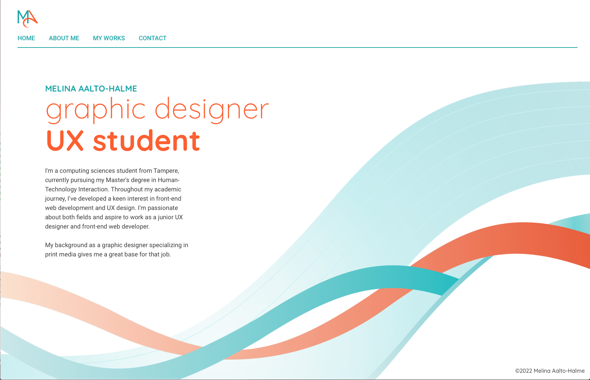

# UI Design / Personal Portfolio Website

## Project Description
As part of the Creating Graphical User Interfaces course at Tampere University, I developed a personal portfolio website. This project showcases my skills in web development and graphic design, featuring a collection of my work from my previous career as a graphic designer. Note that this portfolio focuses exclusively on graphic design work and does not include any UX/UI projects.

The purpose of the course was to learn how to create graphical user interfaces. This project allowed me to apply the skills learned in the course to develop a portfolio website.

## Further Development
While the portfolio demonstrates my skills, there are areas for improvement:

  - **Accessibility:** Addressing current issues to ensure a more inclusive experience.
  - **Layout and CSS:** Refining the design to be responsive across all screen sizes.

Please note that the content of this portfolio, including text and project descriptions, may not always be fully up-to-date. The portfolio is a dynamic work in progress, with updates made sporadically as my studies and professional experience evolve.

## How to Test the Code
To explore and test this portfolio code on your local machine:

1. **Clone or Download Repository:** Click the “Code” button and select your preferred method.
2. **Navigate to Project Directory:** Open your terminal, Git Bash, or a similar tool, and navigate to the root directory of the project.
3. **Install Dependencies:** Run the following command: npm install
4. **Start the Application:** After the dependencies are installed, start the application with: npm start

# Please Note
The project is configured to use Node.js version 14.17.4. Ensure you have this version installed. You can manage your Node.js versions using a version manager like NVM (Node Version Manager).

